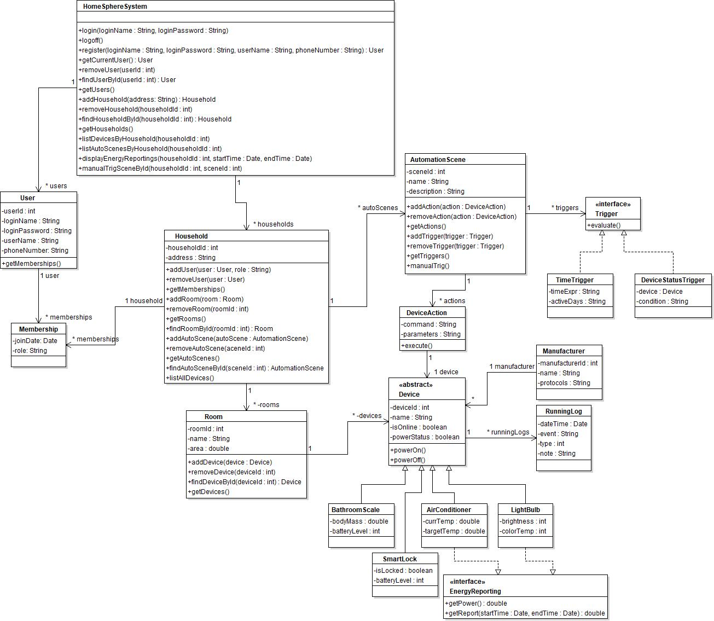

# HomeSphereG 智能家居生态系统 v1.0
HomeSphereG 是一个智能家居生态系统，旨在无缝集成和管理来自不同制造商的各类智能设备，为用户提供场景自动化、能源管理和远程控制等功能。

### 主要功能模块
- **用户与家庭管理**：支持用户注册登录、家庭创建、房间管理等功能
- **设备集成与管理**：支持多种智能设备的统一管理和控制
- **节能减排管理**：设备能耗监控和统计报告
- **自动化与智能场景**：自定义场景和自动化触发规则

## 系统要求

### 开发环境
- **操作系统**：Windows 7/10/11
- **Java版本**：JDK 17 或更高版本
- **开发工具**：Eclipse/IDEA/VS Code 等 IDE

### 运行环境
- Java Runtime Environment (JRE) 8 或更高版本
- 至少 2GB 可用内存
- 100MB 可用磁盘空间

## 项目结构

```
HomeSphereG/
├── main/
│   ├── /src/
│   │   ├── HomeSphereSystem/     # 系统核心类
│   │   │── HomeSphereSystemTest/ # 测试类          
│   │   ├── UserAndHousehold/     # 用户与家庭管理相关类
│   │   ├── DeviceEquipment/      # 设备管理相关类  
│   │   ├── EmissionReduction/    # 能耗管理相关类
│   │   └── AutomatedScene/       # 自动化场景相关类        
├── lib/                          # 依赖库
├── image/                        # 图片资源
└── README.md
```



## 核心功能说明
1. 用户与家庭管理 
- `User` 类：封装用户属性（ID、登录名、密码、姓名、手机号），提供 **login()** / **logout()** 方法，重写 **equals()**（按 ID 比较）和 **toString()**（返回基本属性）。
- `Household` 类：管理家庭属性（ID、地址、管理员），提供 **addUser()** / **removeUser()**（成员管理）、 **addRoom()** / **removeRoom()**（房间管理）、 **listAllDevices()**（查询所有设备）方法。
- `Room` 类：管理房间属性（ID、名称、面积），提供 **addDevice()** / **removeDevice()**（设备分配）、 **searchRoomDevice()**（按房间查设备）方法。
- `Room` 类：管理房间属性（ID、名称、面积），提供 **addDevice()** / **removeDevice()**（设备分配）、 **searchRoomDevice()**（按房间查设备）方法。

2. 设备集成与管理
- `Device` 抽象类：定义设备通用属性（ID、名称、在线状态、电源状态、制造商），提供 **powerOn()** / **powerOff()**（电源控制）方法。
- 具体设备类：
  - `LightBulb`：实现 **setBrightness()**（调亮度）、 **setColorTemp()**（调色温）。
  - `AirConditioner`：实现 **setCurrTemp()** / **setTargetTemp()**（温度设置）。
  - `SmartLock`：实现 **setLocked()**（锁状态）、 **setBatteryLevel()**（电量）。
  - `BathroomScale`：实现 **setBodyMass()**（体重）、 **setBatteryLevel()**（电量）。
- `Manufacturer` 类：封装制造商属性，提供 **toString()**（返回基本属性）。

3. 节能减排管理
- `RunningLog` 类：记录设备运行日志（时间、事件、类型：0=info/1=warning/2=error、备注），提供 **getEvent()** 等查询方法。
- `EnergyReporting` 接口：定义 **getPower()**（获取功率）、 **getReport()**（生成能耗报告），仅 `LightBulb` 和 `AirConditioner` 实现。

4. 自动化与智能场景
- `AutomationScene` 类：管理场景属性（ID、名称、描述），提供 **addAction()**（添加设备动作）、 **addTrigger()**（添加触发器）、 **manualTrig()**（手动触发场景）方法。
- `DeviceAction` 类：封装设备动作（命令、参数、关联设备），提供 **execute()**（执行动作，如 “空调设为 20℃”）方法。
- `Trigger` 接口及实现：
  - `TimeTrigger`：按周期（如周一 / 三 / 六）和时间触发，提供 **setExecuteDate()** / **setExecuteTime()** 方法。
  - `DeviceTrigger`：按设备状态触发（如空调达 20℃），提供 **setTriggeringCondition()** 方法。

5. 系统入口类（`HomeSphereSystem`）
- 初始化users（用户列表）、households（家庭列表），创建默认管理员：User(0, "administrator", "111111", "超级管理员", "13512345678")。
- 提供核心方法： **login()**（用户登录）、 **displayEnergyReportings()**（展示能耗报告）、 **manualTrigSceneById()**（按 ID 触发场景）、 **logoff()**（用户退出）。

6. 系统测试用例（`HomeSphereSystemTest`）
- 测试用例：HomeSphereSystemTest.java，包含 17 个测试函数，验证系统核心功能（用户注册、设备管理、能耗报告、场景触发等）。


## 编译与运行步骤
1. IDE 编译运行（以 IDEA 为例）
- 打开 IDEA，导入项目：选择HomeSphereG根目录，导入为 “Java 项目”。
- 配置 JDK：进入 `File > Project Structure > SDKs`，选择 JDK 17。
- 添加 Junit 依赖：右键项目 `> Open Module Settings > Libraries > +`，导入 `lib/junit.jar`。
- 编译代码：点击顶部 `Build Project`，确保无语法错误。
- 运行系统：找到 `HomeSphereSystem.java`，右键Run，初始化管理员并执行核心功能。

2. 命令行编译运行
- 进入项目根目录，执行编译命令（指定类路径）：
```bash
javac -cp lib/junit.jar -d bin src/com/homesphere/**/*.java
```

- 运行系统（指定类路径和主类）：
```bash
java -cp bin com.homesphere.system.HomeSphereSystem
```
## 单元测试方法
- 测试准备：确保test/HomeSphereSystemTest.java已导入，且junit.jar依赖配置完成。
- 运行测试用例：
IDE 中：右键HomeSphereSystemTest.java > Run Tests，自动执行 17 个测试函数。
   - 关键测试用例对应功能：
  ```
      testHouseholdCreation：验证家庭对象创建及属性查询。
      testHouseholdRoomManagement：验证房间管理功能（添加、删除、查询）。
      testHouseholdUserManagement：验证用户管理功能（添加、删除、查询）。
      testManufacturer：验证制造商属性（创建、查询）。
      testHouseholdListAllDevices：验证查询所有设备功能。
      testRoomDeviceManagement：验证房间设备管理功能（添加、删除、查询）。
      testDevicePowerManagement：验证设备电源开关功能。
      testAirConditionerTemperature：验证空调温度设置功能。
      testLightBulbSettings：验证灯泡亮度和调色温功能。
      testSmartLock：验证智能锁状态和电量功能。
      testBathroomScale：验证 bathroom scale 体重和电量功能。
      testRunningLog：验证运行日志记录功能。
      testEnergyReporting：验证能耗报告生成功能。
      testDeviceAction：验证设备动作执行功能。
      testAutomationScene：验证自动化场景管理功能。
      testHouseholdAutomationSceneManagement：验证家庭自动化场景管理功能。
      testHomeSphereSystem：验证系统核心功能（用户注册、设备管理、能耗报告、场景触发等）。
  ```
  - 自定义测试：在HomeSphereSystemTest.java中新增方法（如testBathroomScaleBodyMass()），按 Junit 规范用@Test注解，验证自定义功能

## 快速上手示例
- 创建家庭：登录后调用Household类的构造方法创建家庭
- 添加设备：通过Room.addDevice()将灯泡添加到客厅
- 设定场景：创建 “回家模式” 场景，添加触发器（TimeTrigger 18:00）和动作（灯泡开启、空调设为 25℃）

## 引用
如果该项目对您有帮助，请引用：
``` html
@software{HomeSphereG,
  author = {NPUYUN},
  title = {HomeSphereG},
  year = {2025},
  url = {https://github.com/NPUYUN/HomeSphereG}
}
```